# Chapter 10 Sinusoidal Steady State Analysis

[TOC]

## 10-1 Circuit Analysis

### Node Analysis

- define node voltage
- define node current ($I_{in}=I_{out}$)

**EX 10-1**

Using nodal analysis, find $v_1$ and $v_2$ in the following circuit

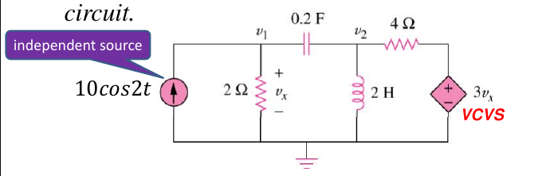

$$
\begin{cases}
    10 = \frac{V_1-V_2}{-2.5j}+\frac{V_1}{2}\\[2ex]
    \frac{V_2}{4j} = \frac{V_1-V_2}{-2.5j}+\frac{3V_1-V_2}{4}
\end{cases}\Longrightarrow
\begin{cases}
    (-2+2.5j)V_1+2V_2 = 50j\\[2ex]
    (-4+7.5j)V_1+(1.5-2.5j)V_2 = 0
\end{cases}
$$

solve the equations by using Carmer's Rule

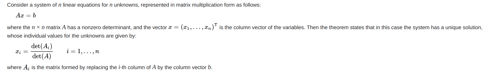

$$
\begin{aligned}
    \det{A} &= \Bigg|\begin{matrix}
            -2+2.5j&2\\[2ex]
            -4+7.5j&1.5-2.5j
            \end{matrix}\Bigg| = 12.87\angle{-29.05^\circ}\\[2ex]
    \det{A_1} &= \Bigg|\begin{matrix}
            50j&2\\[2ex]
            0&1.5-2.5j
            \end{matrix}\Bigg| = 145.77\angle{30.96^\circ}\\[2ex]
    \det{A_2} &= \Bigg|\begin{matrix}
            -2+2.5j&50j\\[2ex]
            -4+7.5j&0
            \end{matrix}\Bigg| = 425\angle{28.07^\circ}\\[2ex]
    V_1 &= \frac{\det{A_1}}{\det{A}} = 11.33\angle{60.01}^\circ V\\[2ex]
    V_2 &= \frac{\det{A_2}}{\det{A}} = 33.02\angle{57.12}^\circ V\\[2ex]
    v_1 &= 11.33\cos(2t+\angle{60.01}^\circ)\; V\\[2ex]
    v_2 &= 33.02\cos(2t+\angle{57.12}^\circ)\; V\\[2ex]
\end{aligned}
$$

### Mesh Analysis

mesh analysis also works well for phasors

**EX 10-2**

Finding $I_0$ using mesh analysis

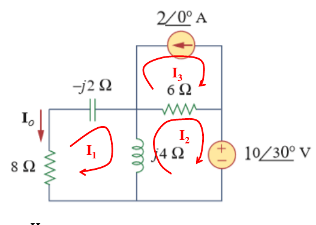

$$
\begin{aligned}
    \begin{cases}
        -2j\times I_1+4j\times(I_1-I_2)+8\times I_1 = 0\\[2ex]
        4j\times (I_2-I_1) + 6(I_2+I_3) = -10\angle{30}^\circ\\[2ex]
        I_3 = 2
    \end{cases}
    &\Longrightarrow I_1 = 1.194\angle{-114.55}^\circ\\[2ex]
    I_0 = - I_1 = 1.194\angle{65.45}^\circ
\end{aligned}
$$

### Superposition Theorem

since as circuits are **linear**, the superposition applies to ac circuits the same way it applies to dc circuits

this theorem becomes important if the circuit has sources operating at different frequencies

the total response must be obtained by adding the individual responses in the time domain

**EX10-3**

Using superposition theorem to calculate $v_0$

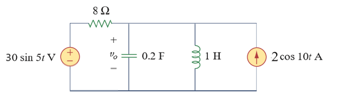

Considering the circuit without voltage source

$$
\begin{aligned}
    V_1 &= 2\times \frac{1}{\frac{1}{8}+\frac{1}{-0.5 j}+\frac{1}{10j}} = 1.05\angle{-86.24}^\circ\\[2ex]
    v_1 &= 1.05\cos(10t-86.24^\circ) 
\end{aligned}
$$

Considering the circuit without current source

$$
\begin{aligned}
    V_2 &= 30 \times \frac{-1.25j}{8-1.25j} = 4.63\angle{-81.12}^\circ\\[2ex]
    v_2 &= 4.63\sin(5t-81.12^\circ)
\end{aligned}
$$

Therefore the voltage is $1.05\cos(10t-86.24^\circ)+4.63\sin(5t-81.12^\circ)$

### Source Transformation

- A linear circuit is replaced by a voltage source in series in series with an impedance
- A linear circuit is replaced by a current source in parallel with an impedance

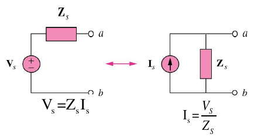

**EX10-4**

Find the Thevenin equivalent at terminals a-b in the following circuit

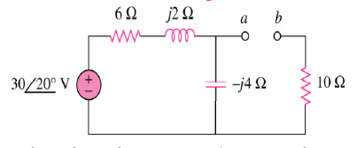

$$
\begin{aligned}
    Z_{th} &= 10+(-4j)||(6+2j)\\[2ex]
           &= 12.81\angle{-14.47}\\[2ex]
    V_{ab} &= \frac{-4j}{6-2j}\times 30\angle{20}^\circ = 18.97\angle{-51.57}^\circ\\[2ex]
\end{aligned}
$$

## 10-2 Operational Amplifier

the amplifier's differential inputs consist of a non-inverting input(+) with voltage $V_+$ and an inverting input(-) with voltage $V_-$

ideally the op amp amplifies only the difference in voltage between the two and the output voltage of the op amp $V_{out}$ is given by the equation

$$
V_{out} = A_{OL}(V_+-V_-)
$$

where $A_{OL}$ is the open-loop gain of the amplifier [1](#refer-1)

### Open-loop Amplifier

Since the magnitude of $A_{OL}$ is typically very large, the op amp without negative feedback will work as a comparator. [2](#refer-2)

$$
\begin{aligned}
    V_{out} = 
        \begin{cases}
            +\infty\qquad V_{in} > 0\\[2ex]
            -\infty\qquad V_{in} < 0
        \end{cases}
\end{aligned}
$$

### Closed-loop Amplifier

- $V_+ = V_-$: when an op amp operates in linear mode, the **difference in voltage** between the non-inverting (+) pin and the inverting (-) pin is **negligibly small**
- $I_{in} = 0$: the **input impedance** between (+) and (-) pins is **much larger** than other resistances in the circuit [3](#refer-3)

## 10-3 Operation Circuits

### Inverting Amplifier

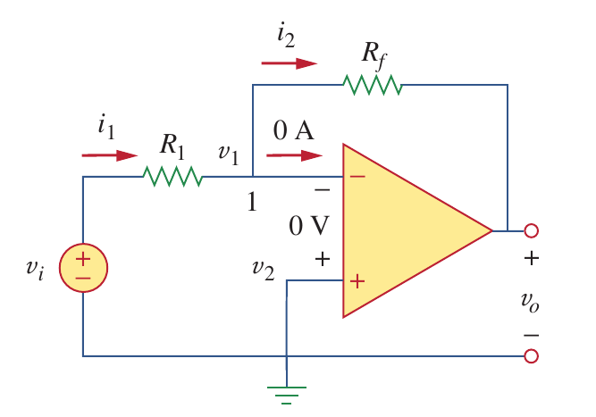

$$
\begin{aligned}
    \frac{v_i-v_1}{R_1} &= \frac{v_1-v_0}{R_f}\\[2ex]
    v_0 &= -\frac{R_f}{R_1}v_i
\end{aligned}
$$

### Noninverting Amplifier

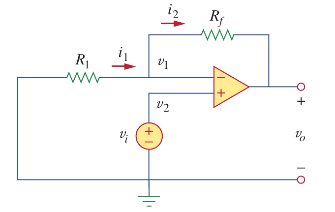

$$
\begin{aligned}
    \frac{0-v_i}{R_1} &= \frac{v_i-v_0}{R_f}\\[2ex]
    v_0 &= \Big(1+\frac{R_f}{R_1}\Big)v_i
\end{aligned}
$$

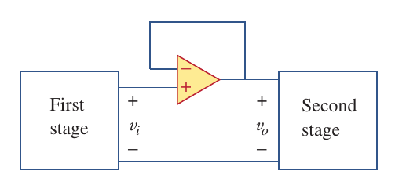

$$
\begin{aligned}
    v_0 = v_i
\end{aligned}
$$

### Summing Amplifier

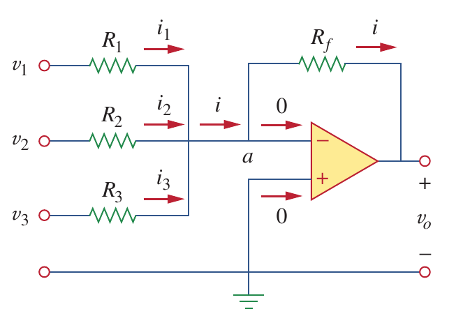

$$
\begin{aligned}
    \frac{0-v_0}{R_f} &= \frac{v_1-0}{R_1}+\frac{v_2-0}{R_2}+\frac{v_3-0}{R_3} \\[2ex]
    v_0 &= -\Big(\frac{R_f}{R_1}v_1+\frac{R_f}{R_2}v_2+\frac{R_f}{R_3}v_3\Big)
\end{aligned}
$$

### Difference Amplifier

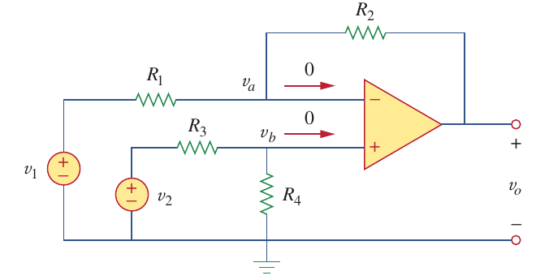

$$
\begin{aligned}
    \begin{cases}
        \frac{v_1-v_a}{R_1} = \frac{v_a-v_0}{R_2}\\[2ex]
        v_a = v_b =\frac{R_4}{R_3+R_4}v_2
    \end{cases}\Longrightarrow
    v_0 = \frac{R_2(1+R_1/R_2)}{R_1(1+R_3/R_4)}v_2-\frac{R_2}{R_1}v_1
\end{aligned}
$$

## 10-4 Comparator Circuit

If we use operation amplifier as the comparator, there come two teo cases

### Noninverting Op-Amp

| 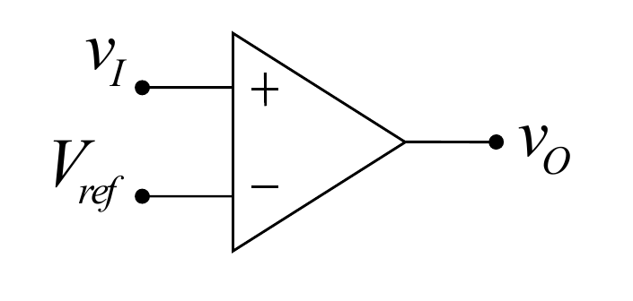 | 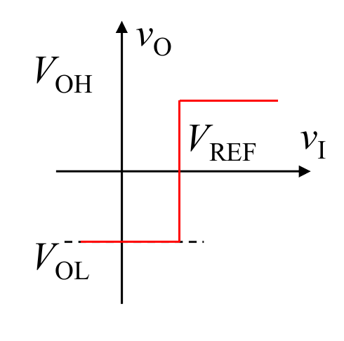 |
| :------------------------------: | :-----------------------------: |

$$
\begin{aligned}
    V_O = 
        \begin{cases}
            +V_{\text{SAT}}\qquad V_i>V_{\text{ref}}\\[2ex]
            -V_{\text{SAT}}\qquad V_i<V_{\text{ref}}
        \end{cases}
\end{aligned}
$$

### Inverting Op-Amp

| 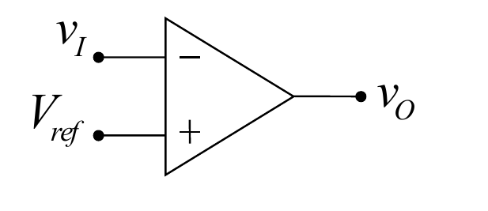 | 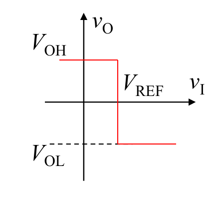 |
| :------------------------------: | :------------------------------: |

$$
\begin{aligned}
    V_O = 
        \begin{cases}
            -V_{\text{SAT}}\qquad V_i>V_{\text{ref}}\\[2ex]
            +V_{\text{SAT}}\qquad V_i<V_{\text{ref}}
        \end{cases}
\end{aligned}
$$

## 10-5 Schmitt Trigger

similarly, there two cases for the Schmitt Trigger

### Basic Inverting Schmitt Trigger

| 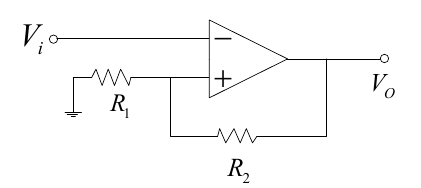 | 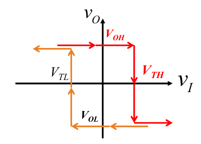 |
| :------------------------------: | :------------------------------: |

- output voltage is high

$$
\begin{aligned}
    V_O = 
    \begin{cases}
        V_{OH}\qquad V_I < \frac{R_1}{R_1+R_2}V_{OH}\\[2ex]
        V_{OL}\qquad V_I > \frac{R_1}{R_1+R_2}V_{OH}
    \end{cases}
\end{aligned}
$$

- output voltage is low

$$
\begin{aligned}
    V_O = 
    \begin{cases}
        V_{OL}\qquad V_I > \frac{R_1}{R_1+R_2}V_{OL}\\[2ex]
        V_{OH}\qquad V_I < \frac{R_1}{R_1+R_2}V_{OL}
    \end{cases}
\end{aligned}
$$

### Noninverting Schmitt Trigger

| 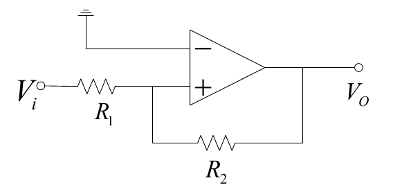 | 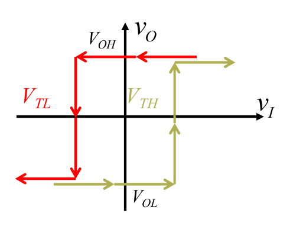 |
| :------------------------------: | :------------------------------: |

- output voltage is high

$$
\begin{aligned}
    V_O = 
    \begin{cases}
        V_{OH}\qquad V_I > -\frac{R_1}{R_2}V_{OH}\\[2ex]
        V_{OL}\qquad V_I < -\frac{R_1}{R_2}V_{OH}
    \end{cases}
\end{aligned}
$$

- output voltage is low

$$
\begin{aligned}
    V_O = 
    \begin{cases}
        V_{OL}\qquad V_I < -\frac{R_1}{R_2}V_{OL}\\[2ex]
        V_{OH}\qquad V_I > -\frac{R_1}{R_2}V_{OL}
    \end{cases}
\end{aligned}
$$

## Reference

- [1] [Operational amplifier - 1 Operation - Wikipedia](https://en.wikipedia.org/wiki/Operational_amplifier#Operation)

- [2] [Operational amplifier - 1.1 Open-loop amplifier - Wikipedia](https://en.wikipedia.org/wiki/Operational_amplifier#Open-loop_amplifier)

- [3] [Operational amplifier - 1.2 Closed-loop amplifier - Wikipedia](https://en.wikipedia.org/wiki/Operational_amplifier#Closed-loop_amplifier)
