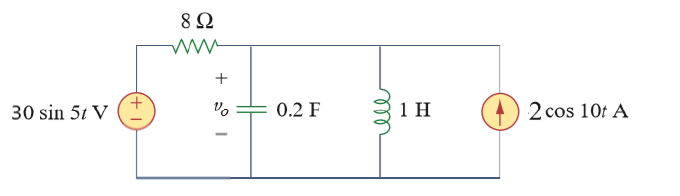

# Lecture-2

[TOC]

## Node Analysis

- define node voltage
- define node current ($I_{in}=I_{out}$)

### EX 10-1

Using nodal analysis, find $v_1$ and $v_2$ in the following circuit

$$
\begin{cases}
    10 = \frac{V_1-V_2}{-2.5j}+\frac{V_1}{2}\\[2ex]
    \frac{V_2}{4j} = \frac{V_1-V_2}{-2.5j}+\frac{3V_1-V_2}{4}
\end{cases}\Longrightarrow
\begin{cases}
    (-2+2.5j)V_1+2V_2 = 50j\\[2ex]
    (-4+7.5j)V_1+(1.5-2.5j)V_2 = 0
\end{cases}
$$

solve the equations by using Carmer's Rule

$$
\begin{aligned}
    \det{A} &= \Bigg|\begin{matrix}
            -2+2.5j&2\\[2ex]
            -4+7.5j&1.5-2.5j
            \end{matrix}\Bigg| = 12.87\angle{-29.05^\circ}\\[2ex]
    \det{A_1} &= \Bigg|\begin{matrix}
            50j&2\\[2ex]
            0&1.5-2.5j
            \end{matrix}\Bigg| = 145.77\angle{30.96^\circ}\\[2ex]
    \det{A_2} &= \Bigg|\begin{matrix}
            -2+2.5j&50j\\[2ex]
            -4+7.5j&0
            \end{matrix}\Bigg| = 425\angle{28.07^\circ}\\[2ex]
    V_1 &= \frac{\det{A_1}}{\det{A}} = 11.33\angle{60.01}^\circ V\\[2ex]
    V_2 &= \frac{\det{A_2}}{\det{A}} = 33.02\angle{57.12}^\circ V\\[2ex]
    v_1 &= 11.33\cos(2t+\angle{60.01}^\circ)\; V\\[2ex]
    v_2 &= 33.02\cos(2t+\angle{57.12}^\circ)\; V\\[2ex]
\end{aligned}
$$

## Mesh Analysis

mesh analysis also works well for phasors

### EX 10-2

Finding $I_0$ using mesh analysis

$$
\begin{aligned}
    \begin{cases}
        -2j\times I_1+4j\times(I_1-I_2)+8\times I_1 = 0\\[2ex]
        4j\times (I_2-I_1) + 6(I_2+I_3) = -10\angle{30}^\circ\\[2ex]
        I_3 = 2
    \end{cases}
    &\Longrightarrow I_1 = 1.194\angle{-114.55}^\circ\\[2ex]
    I_0 = - I_1 = 1.194\angle{65.45}^\circ
\end{aligned}
$$

## Superposition Theorem

since as circuits are **linear**, the superposition applies to ac circuits the same way it applies to dc circuits

this theorem becomes important if the circuit has sources operating at different frequencies

the total response must be obtained by adding the individual responses in the time domain

### EX10-3

Using superposition theorem to calculate $v_0$

Considering the circuit without voltage source

$$
\begin{aligned}
    V_1 &= 2\times \frac{1}{\frac{1}{8}+\frac{1}{-0.5 j}+\frac{1}{10j}} = 1.05\angle{-86.24}^\circ\\[2ex]
    v_1 &= 1.05\cos(10t-86.24^\circ) 
\end{aligned}
$$

Considering the circuit without current source

$$
\begin{aligned}
    V_2 &= 30 \times \frac{-1.25j}{8-1.25j} = 4.63\angle{-81.12}^\circ\\[2ex]
    v_2 &= 4.63\sin(5t-81.12^\circ)
\end{aligned}
$$

Therefore the voltage is $1.05\cos(10t-86.24^\circ)+4.63\sin(5t-81.12^\circ)$

## Source Transformation

### Thevenin and Norton Equivalent Circuits

- A linear circuit is replaced by a voltage source in series in series with an impedance
- A linear circuit is replaced by a current source in parallel with an impedance

### EX10-4

Find the Thevenin equivalent at terminals a-b in the following circuit

$$
\begin{aligned}
    Z_{th} &= 10+(-4j)||(6+2j)\\[2ex]
           &= 12.81\angle{-14.47}\\[2ex]
    V_{ab} &= \frac{-4j}{6-2j}\times 30\angle{20}^\circ = 18.97\angle{-51.57}^\circ\\[2ex]
\end{aligned}
$$