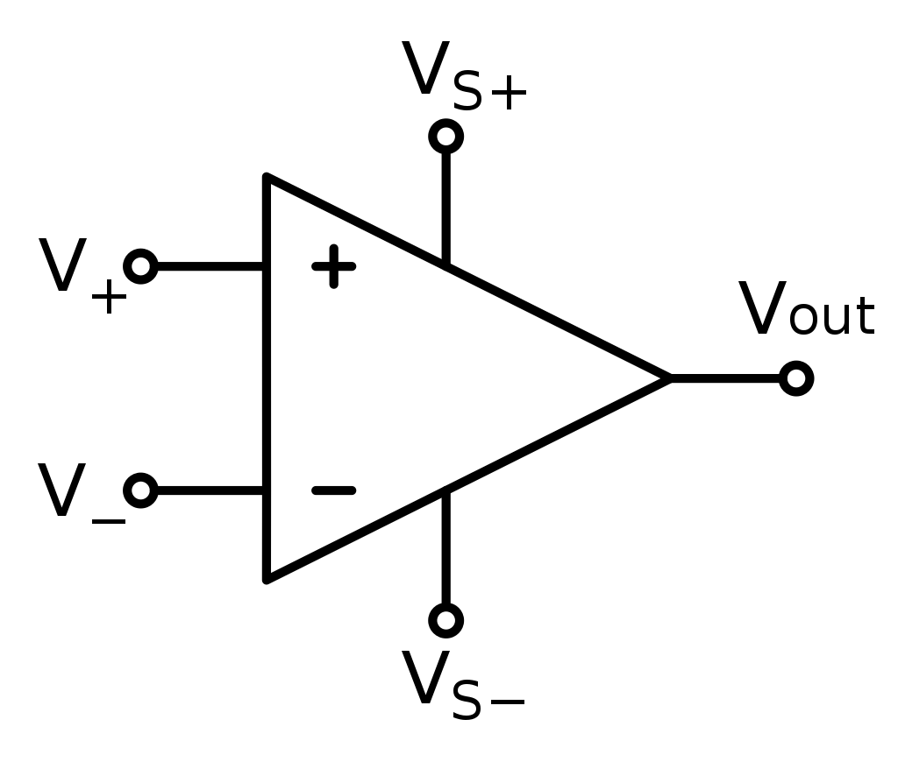
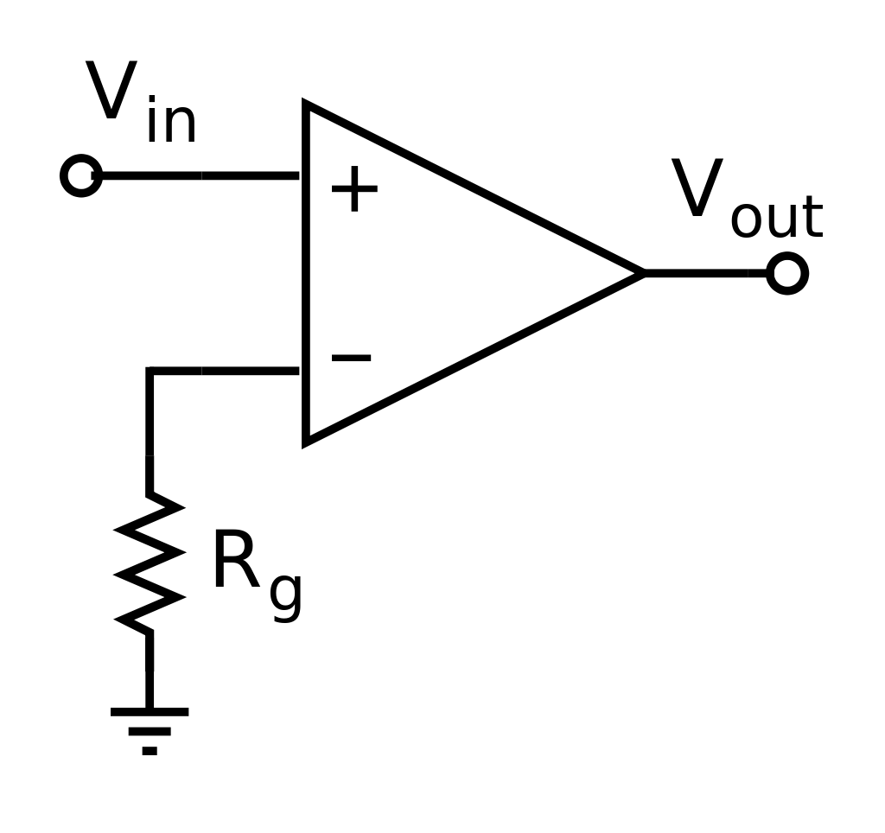
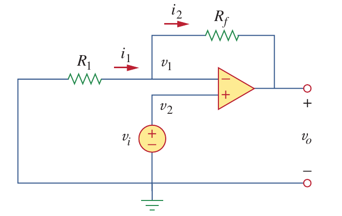
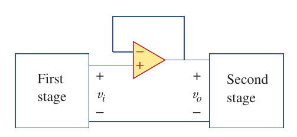
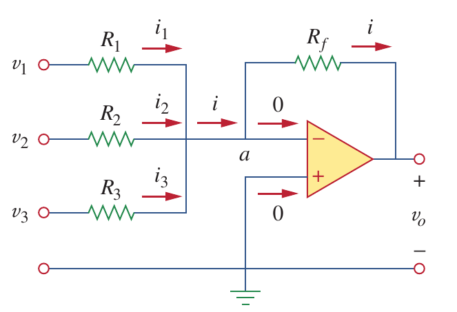

# Lecture-3

[TOC]

## 1 - Operational Amplifier

the amplifier's differential inputs consist of a non-inverting input(+) with voltage $V_+$ and an inverting input(-) with voltage $V_-$

ideally the op amp amplifies only the difference in voltage between the two and the output voltage of the op amp $V_{out}$ is given by the equation

$$
V_{out} = A_{OL}(V_+-V_-)
$$

where $A_{OL}$ is the open-loop gain of the amplifier [1](#refer-1)

### Open-loop Amplifier

Since the magnitude of $A_{OL}$ is typically very large, the op amp without negative feedback will work as a comparator. [2](#refer-2)

$$
\begin{aligned}
    V_{out} = 
        \begin{cases}
            +\infty\qquad V_{in} > 0\\[2ex]
            -\infty\qquad V_{in} < 0
        \end{cases}
\end{aligned}
$$

### Closed-loop Amplifier

- $V_+ = V_-$: when an op amp operates in linear mode, the **difference in voltage** between the non-inverting (+) pin and the inverting (-) pin is **negligibly small**
- $I_{in} = 0$: the **input impedance** between (+) and (-) pins is **much larger** than other resistances in the circuit [3](#refer-3)

## 2 - Inverting Amplifier

$$
\begin{aligned}
    \frac{v_i-v_1}{R_1} &= \frac{v_1-v_0}{R_f}\\[2ex]
    v_0 &= -\frac{R_f}{R_1}v_i
\end{aligned}
$$

## 3 - Noninverting Amplifier

$$
\begin{aligned}
    \frac{0-v_i}{R_1} &= \frac{v_i-v_0}{R_f}\\[2ex]
    v_0 &= \Big(1+\frac{R_f}{R_1}\Big)v_i
\end{aligned}
$$

$$
\begin{aligned}
    v_0 = v_i
\end{aligned}
$$

## 4 - Summing Amplifier

$$
\begin{aligned}
    \frac{0-v_0}{R_f} &= \frac{v_1-0}{R_1}+\frac{v_2-0}{R_2}+\frac{v_3-0}{R_3} \\[2ex]
    v_0 &= -\Big(\frac{R_f}{R_1}v_1+\frac{R_f}{R_2}v_2+\frac{R_f}{R_3}v_3\Big)
\end{aligned}
$$

## 5 - Difference Amplifier

$$
\begin{aligned}
    \begin{cases}
        \frac{v_1-v_a}{R_1} = \frac{v_a-v_0}{R_2}\\[2ex]
        v_a = v_b =\frac{R_4}{R_3+R_4}v_2
    \end{cases}\Longrightarrow
    v_0 = \frac{R_2(1+R_1/R_2)}{R_1(1+R_3/R_4)}v_2-\frac{R_2}{R_1}v_1
\end{aligned}
$$

## Reference

- [1] [Operational amplifier - 1 Operation - Wikipedia](https://en.wikipedia.org/wiki/Operational_amplifier#Operation)

- [2] [Operational amplifier - 1.1 Open-loop amplifier - Wikipedia](https://en.wikipedia.org/wiki/Operational_amplifier#Open-loop_amplifier)

- [2] [Operational amplifier - 1.2 Closed-loop amplifier - Wikipedia](https://en.wikipedia.org/wiki/Operational_amplifier#Closed-loop_amplifier)

