# Lecture-4

[TOC]

## 1 - Transfer Function

### Definition

$$
\bold{H}(\omega) = \frac{\bold{Y}(\omega)}{\bold{X}(\omega)}
$$

the transfer function $\bold{H}(\omega)$ of a circuit is the frequency-dependent ratio of a phasor output $\bold{Y}(\omega)$ to a phasor input $\bold{X}(\omega)$

since the input and output can be either voltage  or current at any place in the circuit, there are four possible transfer functions

$$
\begin{aligned}
    H(\omega) &= \text{Voltage Gain}=\frac{V_O(\omega)}{V_i(\omega)}\\[2ex]
    H(\omega) &= \text{Current Gain}=\frac{I_O(\omega)}{I_i(\omega)}\\[2ex]
    H(\omega) &= \text{Transfer Impedance}=\frac{V_O(\omega)}{I_i(\omega)}\\[2ex]
    H(\omega) &= \text{Transfer Admittance}=\frac{I_O(\omega)}{V_i(\omega)}\\[2ex]
\end{aligned}
$$

### Zeros and Poles

the transfer function $\bold{H}(\omega)$ can also be expressed in terms of its numerator polynomial $\bold{N}(\omega)$ and denominator polynomial $\bold{D}(\omega)$

$$
\bold{H}(\omega) = \frac{\bold{N}(\omega)}{\bold{D}(\omega)}
$$

- **zeros**: the *roots* of the numerator polynomial $\bold{N}(\omega)$
- **poles**: the *roots* of the denominator polynomial $\bold{D}(\omega)$

## 2 - Decibel Scale and Bode Plots

### Decibel Scale

$$
\begin{aligned}
    G_{dB} &= 10\log_{10}{\frac{P_2}{P_1}}= 10\log_{10}{\frac{V_2^2/R_2}{V_1^2/R_1}}\\[2ex]
           &= 10\log_{10}{\Big(\frac{V_2}{V_1}\Big)^2}-10\log_{10}{\frac{R_1}{R_2}}\\[2ex]
           &= 20\log_{10}{\frac{V_1}{V_2}}-10\log_{10}{\frac{R_1}{R_2}}
\end{aligned}
$$

for the case when $R_1 = R_2$, we can get the basic equation 

$$
G_{dB} = 20\log_{10}{\frac{V_1}{V_2}}
$$

### Bode Plots

one transfer function could be written in terms of factors that have real and imaginary parts

$$
\bold{H}(j\omega) = \frac{K(j\omega)^{\pm 1}(1+j\omega/z_1)[1+j2\zeta\omega/\omega_k+(j\omega/\omega_k)^2]\cdots}{(1+j\omega/p_1)[1+j2\zeta_2\omega/\omega_n+(j\omega/\omega_n)^2]\cdots}
$$

which combines several types of factors:

- gain $K$
- zero $(j\omega)$ or pole $(j\omega)^{-1}$ at the origin
- simple zero $(1+j\omega/z_1)$ or pole $1/(1+j\omega/p_1)$
- quadratic zero $[1+j2\zeta_2\omega/\omega_k+(j\omega/\omega_k)^2]$ or pole $1/[1+j2\zeta_2\omega/\omega_n+(j\omega/\omega_n)^2]$

| Factor |            Magnitude             |            Phase             |
| :----: | :------------------------------: | :--------------------------: |
|  $K$   | 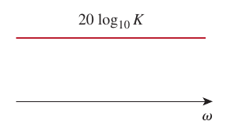 | 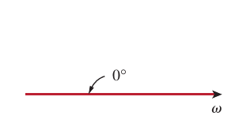 |
|$(j\omega)^N$|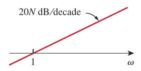|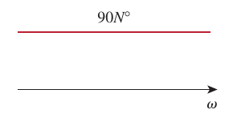|
|$\frac{1}{(j\omega)^N}$|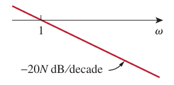|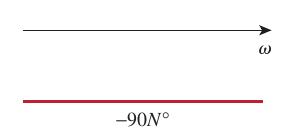|
|$\Big(1+\frac{j\omega}{z}\Big)^N$|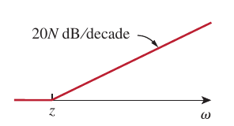|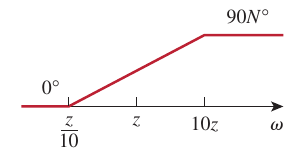|
|$\frac{1}{(1+j\omega/p)^N}$|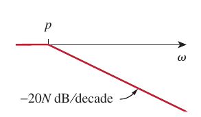|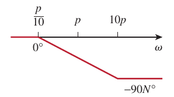|
|$\Big[1+\frac{2j\omega\zeta}{\omega_n}+\big(\frac{j\omega}{\omega_n}\big)^2\Big]^N$|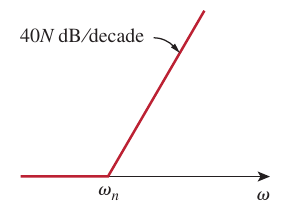|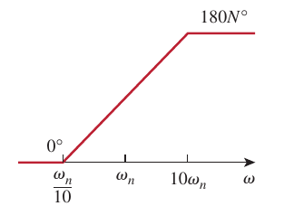|
|$\frac{1}{[1+2j\omega\zeta/\omega_k+(j\omega/\omega_k)^2]^N}$|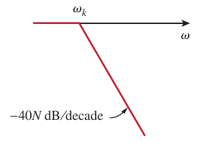|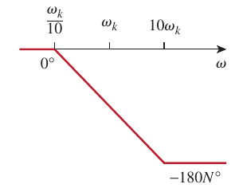|