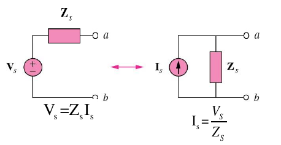
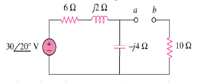
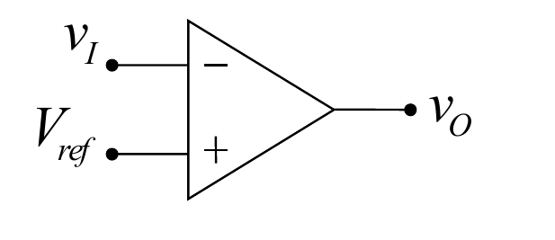
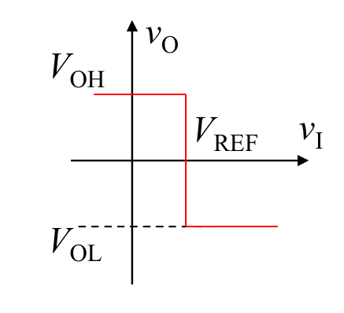
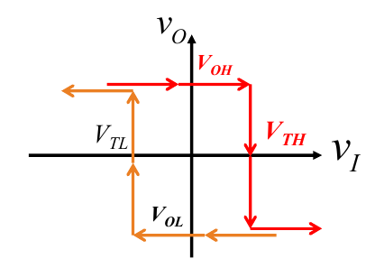
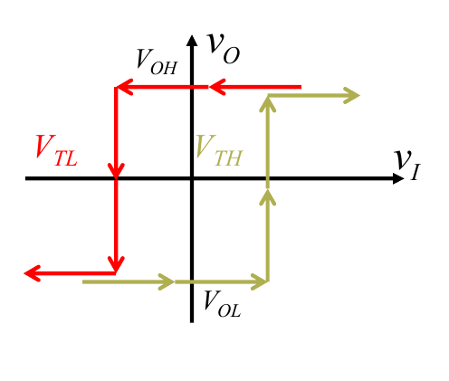
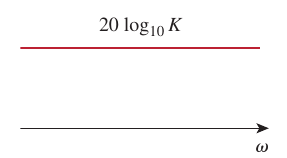
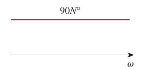
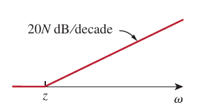
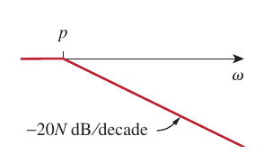

# Overview

[TOC]

## Part I Sinusoids and Phasors

### Introduction

A **sinusoid** is a signal that has the form of the sine or cosine function

### 1-1 Sinusoids

#### Definition
$$
v(t) = V_m\sin{\omega t}
$$

- $\omega = \frac{2\pi}{T}$
- $T = \frac{2\pi}{\omega}$
- $f = \frac{1}{T}$
- $\omega = 2\pi f$

sinusoids are periodic, which implies $v(t+T) = v(t)$

#### Phase

$$
v_1(t) = V_m\sin{\omega t}
v_2(t) = V_m\sin{(\omega t+\phi)}
$$

where $\phi$ is the **phase**

#### Combining Sinusoids

$$
A \cos{\omega t}+B\sin{\omega t} = \sqrt{A^2+B^2}\cos{(\omega t-\theta)}
$$

where $\theta = \arctan{\frac{B}{A}}$

### 1-2 Phasors

#### Definition

A **phasor** is a complex number that represents the amplitude and phase of a sinusoid

$$
z = x+jy= r\angle\phi=re^{j\phi}=r(\cos\phi+j\sin\phi)
$$

$$
e^{\pm j\phi}=\cos\phi\pm j\sin \phi
$$

#### Calculation

$$
\begin{aligned}
\frac{\mathrm{d}v}{\mathrm{d}t}\longleftrightarrow j\omega V\\[2ex]
\int{v\mathrm{d}t}\longleftrightarrow \frac{V}{j\omega}\\[2ex]
\end{aligned}
$$

#### Phasors and Circuit Elements

##### Inductor

if the current in the inductor is $i(t)=I_m\cos(\omega t+\phi)$ then the voltage across it will be
$$
\begin{aligned}
v = L\frac{\mathrm{d}i}{\mathrm{d}t}&=-\omega LI_m\sin(\omega t+\phi)\\[2ex]
    &= \omega LI_m\cos(\omega t+\phi+90^\circ)
\end{aligned}
$$

transforming as a phasor and take $I_m e^{j\phi}$ as $I$

$$
V = \omega LI_m e^{j(\phi+90^\circ)} = j\omega LI
$$

##### Conductor

similarly since the current on the conductor is $C\frac{\mathrm{d}v}{\mathrm{d}t}$

$$
V = \frac{I}{j\omega C}
$$

## Part II Sinusoidal Steady State Analysis

### 2-1 Circuit Analysis

#### Node Analysis

- define node voltage
- define node current ($I_{in}=I_{out}$)

**EX 2-1**

Using nodal analysis, find $v_1$ and $v_2$ in the following circuit

$$
\begin{cases}
    10 = \frac{V_1-V_2}{-2.5j}+\frac{V_1}{2}\\[2ex]
    \frac{V_2}{4j} = \frac{V_1-V_2}{-2.5j}+\frac{3V_1-V_2}{4}
\end{cases}\Longrightarrow
\begin{cases}
    (-2+2.5j)V_1+2V_2 = 50j\\[2ex]
    (-4+7.5j)V_1+(1.5-2.5j)V_2 = 0
\end{cases}
$$

solve the equations by using Carmer's Rule

$$
\begin{aligned}
    \det{A} &= \Bigg|\begin{matrix}
            -2+2.5j&2\\[2ex]
            -4+7.5j&1.5-2.5j
            \end{matrix}\Bigg| = 12.87\angle{-29.05^\circ}\\[2ex]
    \det{A_1} &= \Bigg|\begin{matrix}
            50j&2\\[2ex]
            0&1.5-2.5j
            \end{matrix}\Bigg| = 145.77\angle{30.96^\circ}\\[2ex]
    \det{A_2} &= \Bigg|\begin{matrix}
            -2+2.5j&50j\\[2ex]
            -4+7.5j&0
            \end{matrix}\Bigg| = 425\angle{28.07^\circ}\\[2ex]
    V_1 &= \frac{\det{A_1}}{\det{A}} = 11.33\angle{60.01}^\circ V\\[2ex]
    V_2 &= \frac{\det{A_2}}{\det{A}} = 33.02\angle{57.12}^\circ V\\[2ex]
    v_1 &= 11.33\cos(2t+\angle{60.01}^\circ)\; V\\[2ex]
    v_2 &= 33.02\cos(2t+\angle{57.12}^\circ)\; V\\[2ex]
\end{aligned}
$$

#### Mesh Analysis

mesh analysis also works well for phasors

**EX 2-2**

Finding $I_0$ using mesh analysis

$$
\begin{aligned}
    \begin{cases}
        -2j\times I_1+4j\times(I_1-I_2)+8\times I_1 = 0\\[2ex]
        4j\times (I_2-I_1) + 6(I_2+I_3) = -10\angle{30}^\circ\\[2ex]
        I_3 = 2
    \end{cases}
    &\Longrightarrow I_1 = 1.194\angle{-114.55}^\circ\\[2ex]
    I_0 = - I_1 = 1.194\angle{65.45}^\circ
\end{aligned}
$$

#### Superposition Theorem

since as circuits are **linear**, the superposition applies to ac circuits the same way it applies to dc circuits

this theorem becomes important if the circuit has sources operating at different frequencies

the total response must be obtained by adding the individual responses in the time domain

**EX2-3**

Using superposition theorem to calculate $v_0$

Considering the circuit without voltage source

$$
\begin{aligned}
    V_1 &= 2\times \frac{1}{\frac{1}{8}+\frac{1}{-0.5 j}+\frac{1}{10j}} = 1.05\angle{-86.24}^\circ\\[2ex]
    v_1 &= 1.05\cos(10t-86.24^\circ) 
\end{aligned}
$$

Considering the circuit without current source

$$
\begin{aligned}
    V_2 &= 30 \times \frac{-1.25j}{8-1.25j} = 4.63\angle{-81.12}^\circ\\[2ex]
    v_2 &= 4.63\sin(5t-81.12^\circ)
\end{aligned}
$$

Therefore the voltage is $1.05\cos(10t-86.24^\circ)+4.63\sin(5t-81.12^\circ)$

#### Source Transformation

- A linear circuit is replaced by a voltage source in series in series with an impedance
- A linear circuit is replaced by a current source in parallel with an impedance

**EX2-4**

Find the Thevenin equivalent at terminals a-b in the following circuit

$$
\begin{aligned}
    Z_{th} &= 10+(-4j)||(6+2j)\\[2ex]
           &= 12.81\angle{-14.47}\\[2ex]
    V_{ab} &= \frac{-4j}{6-2j}\times 30\angle{20}^\circ = 18.97\angle{-51.57}^\circ\\[2ex]
\end{aligned}
$$

### 2-2 Operational Amplifier

the amplifier's differential inputs consist of a non-inverting input(+) with voltage $V_+$ and an inverting input(-) with voltage $V_-$

ideally the op amp amplifies only the difference in voltage between the two and the output voltage of the op amp $V_{out}$ is given by the equation

$$
V_{out} = A_{OL}(V_+-V_-)
$$

where $A_{OL}$ is the open-loop gain of the amplifier [1](#refer-1)

#### Open-loop Amplifier

Since the magnitude of $A_{OL}$ is typically very large, the op amp without negative feedback will work as a comparator. [2](#refer-2)

$$
\begin{aligned}
    V_{out} = 
        \begin{cases}
            +\infty\qquad V_{in} > 0\\[2ex]
            -\infty\qquad V_{in} < 0
        \end{cases}
\end{aligned}
$$

#### Closed-loop Amplifier

- $V_+ = V_-$: when an op amp operates in linear mode, the **difference in voltage** between the non-inverting (+) pin and the inverting (-) pin is **negligibly small**
- $I_{in} = 0$: the **input impedance** between (+) and (-) pins is **much larger** than other resistances in the circuit [3](#refer-3)

### 2-3 Operation Circuits

#### Inverting Amplifier

$$
\begin{aligned}
    \frac{v_i-v_1}{R_1} &= \frac{v_1-v_0}{R_f}\\[2ex]
    v_0 &= -\frac{R_f}{R_1}v_i
\end{aligned}
$$

#### Noninverting Amplifier

$$
\begin{aligned}
    \frac{0-v_i}{R_1} &= \frac{v_i-v_0}{R_f}\\[2ex]
    v_0 &= \Big(1+\frac{R_f}{R_1}\Big)v_i
\end{aligned}
$$

$$
\begin{aligned}
    v_0 = v_i
\end{aligned}
$$

#### Summing Amplifier

$$
\begin{aligned}
    \frac{0-v_0}{R_f} &= \frac{v_1-0}{R_1}+\frac{v_2-0}{R_2}+\frac{v_3-0}{R_3} \\[2ex]
    v_0 &= -\Big(\frac{R_f}{R_1}v_1+\frac{R_f}{R_2}v_2+\frac{R_f}{R_3}v_3\Big)
\end{aligned}
$$

#### Difference Amplifier

$$
\begin{aligned}
    \begin{cases}
        \frac{v_1-v_a}{R_1} = \frac{v_a-v_0}{R_2}\\[2ex]
        v_a = v_b =\frac{R_4}{R_3+R_4}v_2
    \end{cases}\Longrightarrow
    v_0 = \frac{R_2(1+R_1/R_2)}{R_1(1+R_3/R_4)}v_2-\frac{R_2}{R_1}v_1
\end{aligned}
$$

### 2-4 Comparator Circuit

If we use operation amplifier as the comparator, there come two teo cases

#### Noninverting Op-Amp

|  |  |
| :------------------------------: | :-----------------------------: |

$$
\begin{aligned}
    V_O = 
        \begin{cases}
            +V_{\text{SAT}}\qquad V_i>V_{\text{ref}}\\[2ex]
            -V_{\text{SAT}}\qquad V_i<V_{\text{ref}}
        \end{cases}
\end{aligned}
$$

#### Inverting Op-Amp

|  |  |
| :------------------------------: | :------------------------------: |

$$
\begin{aligned}
    V_O = 
        \begin{cases}
            -V_{\text{SAT}}\qquad V_i>V_{\text{ref}}\\[2ex]
            +V_{\text{SAT}}\qquad V_i<V_{\text{ref}}
        \end{cases}
\end{aligned}
$$

### 2-5 Schmitt Trigger

similarly, there two cases for the Schmitt Trigger

#### Basic Inverting Schmitt Trigger

|  |  |
| :------------------------------: | :------------------------------: |

- output voltage is high

$$
\begin{aligned}
    V_O = 
    \begin{cases}
        V_{OH}\qquad V_I < \frac{R_1}{R_1+R_2}V_{OH}\\[2ex]
        V_{OL}\qquad V_I > \frac{R_1}{R_1+R_2}V_{OH}
    \end{cases}
\end{aligned}
$$

- output voltage is low

$$
\begin{aligned}
    V_O = 
    \begin{cases}
        V_{OL}\qquad V_I > \frac{R_1}{R_1+R_2}V_{OL}\\[2ex]
        V_{OH}\qquad V_I < \frac{R_1}{R_1+R_2}V_{OL}
    \end{cases}
\end{aligned}
$$

#### Noninverting Schmitt Trigger

|  |  |
| :------------------------------: | :------------------------------: |

- output voltage is high

$$
\begin{aligned}
    V_O = 
    \begin{cases}
        V_{OH}\qquad V_I > -\frac{R_1}{R_2}V_{OH}\\[2ex]
        V_{OL}\qquad V_I < -\frac{R_1}{R_2}V_{OH}
    \end{cases}
\end{aligned}
$$

- output voltage is low

$$
\begin{aligned}
    V_O = 
    \begin{cases}
        V_{OL}\qquad V_I < -\frac{R_1}{R_2}V_{OL}\\[2ex]
        V_{OH}\qquad V_I > -\frac{R_1}{R_2}V_{OL}
    \end{cases}
\end{aligned}
$$

## Part III Frequency Response and Bode Plots

### 3-1 Transfer Function

#### Definition

$$
\bold{H}(\omega) = \frac{\bold{Y}(\omega)}{\bold{X}(\omega)}
$$

the transfer function $\bold{H}(\omega)$ of a circuit is the frequency-dependent ratio of a phasor output $\bold{Y}(\omega)$ to a phasor input $\bold{X}(\omega)$

since the input and output can be either voltage  or current at any place in the circuit, there are four possible transfer functions

$$
\begin{aligned}
    H(\omega) &= \text{Voltage Gain}=\frac{V_O(\omega)}{V_i(\omega)}\\[2ex]
    H(\omega) &= \text{Current Gain}=\frac{I_O(\omega)}{I_i(\omega)}\\[2ex]
    H(\omega) &= \text{Transfer Impedance}=\frac{V_O(\omega)}{I_i(\omega)}\\[2ex]
    H(\omega) &= \text{Transfer Admittance}=\frac{I_O(\omega)}{V_i(\omega)}\\[2ex]
\end{aligned}
$$

#### Zeros and Poles

the transfer function $\bold{H}(\omega)$ can also be expressed in terms of its numerator polynomial $\bold{N}(\omega)$ and denominator polynomial $\bold{D}(\omega)$

$$
\bold{H}(\omega) = \frac{\bold{N}(\omega)}{\bold{D}(\omega)}
$$

- **zeros**: the *roots* of the numerator polynomial $\bold{N}(\omega)$
- **poles**: the *roots* of the denominator polynomial $\bold{D}(\omega)$

### 3-2 Decibel Scale and Bode Plots

#### Decibel Scale

$$
\begin{aligned}
    G_{dB} &= 10\log_{10}{\frac{P_2}{P_1}}= 10\log_{10}{\frac{V_2^2/R_2}{V_1^2/R_1}}\\[2ex]
           &= 10\log_{10}{\Big(\frac{V_2}{V_1}\Big)^2}-10\log_{10}{\frac{R_1}{R_2}}\\[2ex]
           &= 20\log_{10}{\frac{V_1}{V_2}}-10\log_{10}{\frac{R_1}{R_2}}
\end{aligned}
$$

for the case when $R_1 = R_2$, we can get the basic equation 

$$
G_{dB} = 20\log_{10}{\frac{V_1}{V_2}}
$$

#### Bode Plots

one transfer function could be written in terms of factors that have real and imaginary parts

$$
\bold{H}(j\omega) = \frac{K(j\omega)^{\pm 1}(1+j\omega/z_1)[1+j2\zeta\omega/\omega_k+(j\omega/\omega_k)^2]\cdots}{(1+j\omega/p_1)[1+j2\zeta_2\omega/\omega_n+(j\omega/\omega_n)^2]\cdots}
$$

which combines several types of factors:

- gain $K$
- zero $(j\omega)$ or pole $(j\omega)^{-1}$ at the origin
- simple zero $(1+j\omega/z_1)$ or pole $1/(1+j\omega/p_1)$
- quadratic zero $[1+j2\zeta_2\omega/\omega_k+(j\omega/\omega_k)^2]$ or pole $1/[1+j2\zeta_2\omega/\omega_n+(j\omega/\omega_n)^2]$

|                                       Factor                                        |             Magnitude             |             Phase             |
| :---------------------------------------------------------------------------------: | :-------------------------------: | :---------------------------: |
|                                         $K$                                         |   |   |
|                                    $(j\omega)^N$                                    |   |   |
|                               $\frac{1}{(j\omega)^N}$                               |   |   |
|                          $\Big(1+\frac{j\omega}{z}\Big)^N$                          |   |   |
|                             $\frac{1}{(1+j\omega/p)^N}$                             |   |  |
| $\Big[1+\frac{2j\omega\zeta}{\omega_n}+\big(\frac{j\omega}{\omega_n}\big)^2\Big]^N$ |  |  |
|            $\frac{1}{[1+2j\omega\zeta/\omega_k+(j\omega/\omega_k)^2]^N}$            |  |  |

### 3-3 Power Considerations

#### Instantaneous Power

$$
p(t) = \frac{1}{2}V_m I_m \cos (\theta_v-\theta_i)+\frac{1}{2}V_mI_m\cos(2\omega t+\theta_v+\theta_i)
$$

where we can see that the first part is constant while the second part is periodic

#### Average Power

$$
P = \frac{1}{2}V_mI_m\cos(\theta_v-\theta_i)
$$

#### Maximum Average Power Transfer

$$
P = \frac{1}{2}|I|^2R_L=\frac{|V_{Th}|^2R_L/2}{(R_{Th}+R_L)^2+(X_{Th}+X_L)^2}
$$

How to adjust the load parameters $R_L$ and $X_L$ so that **P is maximum**

$$
\begin{cases}
    X_L = -X_{Th}\\[2ex]
    R_L = \sqrt{R_{Th}^2+(X_{Th}+X_L)^2}
\end{cases}
$$

Therefore, $Z_L = R_{Th}-jX_{Th} = Z_{Th}^*$

### 3-4 Series & Parallel Resonance

#### Series Resonance

$$
Z = R+j(\omega L-\frac{1}{\omega C})
$$

Resonance is a condition in an RLC circuit in which the **capacitive and inductive reactances are equal in magnitude** thereby resulting in **a purely resistive impedance**

$$
\omega_0 = \frac{1}{\sqrt{LC}}\qquad f_0=\frac{1}{2\pi \sqrt{LC}}
$$

#### Bandwidth

Half-power frequencies $\omega_1$ and $\omega_2$ are frequencies at which the dissipated power is **half the maximum value**

$$
\omega_1 = -\frac{R}{2L}+\sqrt{\Big(\frac{R}{2L}\Big)^2+\frac{1}{LC}}\qquad \omega_2 = \frac{R}{2L}+\sqrt{\Big(\frac{R}{2L}\Big)^2+\frac{1}{LC}}
$$

where we can find

$$
\omega_0 =\sqrt{\omega_1\omega_2}\qquad B = \omega_2-\omega_1
$$

#### Quality Factor

$$
Q = \frac{\omega_0L}{R} = \frac{1}{\omega_0CR}
$$

and the relationship between the $B$, $Q$ and $\omega_0$

$$
B = \frac{R}{L} = \frac{\omega_0}{Q} = \omega_0^2CR
$$

### 3-5 Passive & Active Filters

#### Passive Filters

##### LPF

|  |  |
| :----------------------: | :----------------------: |
|         Circuit          |    Frequency Response    |

$$
\omega_C = \frac{1}{RC}
$$

##### HPF

|  |  |
| :----------------------: | :----------------------: |
|         Circuit          |    Frequency Response    |

$$
\omega_C = \frac{1}{RC}
$$

##### BPF

|  |  |
| :----------------------: | :----------------------: |
|         Circuit          |    Frequency Response    |

$$
\omega_0 = \frac{1}{\sqrt{LC}}
$$

##### BSF

|  |  |
| :----------------------: | :----------------------: |
|         Circuit          |    Frequency Response    |

$$
\omega_0 = \frac{1}{\sqrt{LC}}
$$

#### Active Filters

##### First-order Low-pass Filter

$$
\omega_C = \frac{1}{R_fC_f}
$$

##### First-order High-pass Filter

$$
\omega_C = \frac{1}{R_iC_i}
$$

## Part IV Laplace Transform

### 4-1 The Laplace Transform

$$
X(s) = \int_{0^-}^{\infty}{x(t)e^{-st}\mathrm{d}t}
$$

which is called as the one-sided Laplace Transform

### 4-2 Useful Equations and Properties Table

$$
\begin{aligned}
\frac{\mathrm{d}}{\mathrm{d}t}x(t)&\longleftrightarrow sX(s)-x(0^{-})\\[2ex]
\frac{\mathrm{d}^2}{\mathrm{d}t^2}x(t)&\longleftrightarrow s^2X(s)-sx(0^-)-x'(0^{-})\\[2ex]
\end{aligned}
$$

|           Aperiodic Signal           |            Fourier Signal            |                   Signal                    |                 Transform                  |     ROC     |
| :----------------------------------: | :----------------------------------: | :-----------------------------------------: | :----------------------------------------: | :---------: |
|            $ax(t)+by(t)$             |            $aX(s)+bY(s)$             |                $\delta (t)$                 |                     1                      |   All $s$   |
|              $x(t-t_0)$              |           $e^{-s t_0}X(s)$           |                   $u(t)$                    |               $\frac{1}{s}$                |    $s>0$    |
|           $e^{s_0 t}x(t)$            |              $X(s-s_0)$              |                  $-u(-t)$                   |               $\frac{1}{s}$                |    $s<0$    |
|               $x^*(t)$               |              $X^*(s^*)$              |        $\frac{t^{n-1}}{(n-1)!}u(t)$         |              $\frac{1}{s^n}$               |    $s>0$    |
|               $x(at)$                |   $\frac{1}{\|a\|}X(\frac{s}{a})$    |       $-\frac{t^{n-1}}{(n-1)!}u(-t)$        |              $\frac{1}{s^n}$               |    $s<0$    |
|               $x(-t)$                |               $X(-s)$                |             $e^{-\alpha t}u(t)$             |            $\frac{1}{s+\alpha}$            | $s>-\alpha$ |
|             $x(t)*y(t)$              |              $X(s)Y(s)$              |            $-e^{-\alpha t}u(-t)$            |            $\frac{1}{s+\alpha}$            | $s<-\alpha$ |
| $\frac{\mathrm{d}}{\mathrm{d}t}x(t)$ |               $s X(s)$               |  $\frac{t^{n-1}}{(n-1)!}e^{-\alpha t}u(t)$  |          $\frac{1}{(s+\alpha)^n}$          | $s>-\alpha$ |
| $\int_{-\infty}^t{x(t)\mathrm{d}t}$  |          $\frac{1}{s}X(s)$           | $-\frac{t^{n-1}}{(n-1)!}e^{-\alpha t}u(-t)$ |          $\frac{1}{(s+\alpha)^n}$          | $s<-\alpha$ |
|               $-tx(t)$               | $\frac{\mathrm{d}}{\mathrm{d}s}X(s)$ |                $\delta(t-T)$                |                 $e^{-sT}$                  |   All $s$   |
|                                      |                                      |           $[\cos\omega_0 t]u(t)$            |         $\frac{s}{s^2+\omega_0^2}$         |    $s>0$    |
|                                      |                                      |           $[\sin\omega_0 t]u(t)$            |     $\frac{\omega_0}{s^2+\omega_0^2}$      |    $s>0$    |
|                                      |                                      |     $[e^{-\alpha t}\cos\omega_0 t]u(t)$     | $\frac{s+\alpha}{(s+\alpha)^2+\omega_0^2}$ | $s>\alpha$  |
|                                      |                                      |     $[e^{-\alpha t}\sin\omega_0 t]u(t)$     | $\frac{\omega_0}{(s+\alpha)^2+\omega_0^2}$ | $s>\alpha$  |

### 4-3 The Inverse Laplace Transform

Given $F(s)$, how do we transform it back to the time domain and obtain the corresponding $f(t)$

$$
X(s) = \frac{N(s)}{D(s)}
$$

- the roots of $N(s)$ are defined as the zeros
- the roots of $S(s)$ are defined as the poles

$F(s)$ can always be reduced to a ratio with $m<n$ by polynomial division

#### Simple Poles

if the degree of $N(s)$ is less than the degree of $D(s)$

$$
F(s) = \frac{k_1}{s+p_1}+\frac{k_2}{s+p_2}+\cdots+\frac{k_n}{s+p_n}
$$

> where $k_i = (s+p_i)F(s)\Big|_{s=-p_i}$

#### Repeated Poles

$$
F(s) = \frac{k_n}{(s+p)^n}+\frac{k_{n-1}}{(s+p)^{n-1}}+\cdots+\frac{k_1}{s+p}
$$

#### Complex Poles

$$
F(s) = \frac{A_1s+A_2}{s^2+as+b}=\frac{A_1(s+\alpha)}{(s+\alpha)^2+\beta^2}+\frac{B_1\beta}{(s+\alpha)^2+\beta^2}
$$

### 4-4 Initial and Final Value Theorems

- Initial Value: $f(0)=\lim_{s\to\infty}{sF(s)}$
- Final Value: $f(\infty)=\lim_{s\to0}{sF(s)}$

> Final value theorem **fails** if the real part of pole is **non-negative**

### 4-5 The Convolution Integral

$$
y(t)=\int{x(\tau)h(t-\tau)\mathrm{d}\tau}\overset{L}{\Longleftrightarrow}Y(s)=X(s)H(s)
$$

### 4-6 Applications of Laplace Transform

- Resistor: $Z(s)=R$
- Inductor: $Z(s)=sL$
- Capacitor: $Z(s)=\frac{1}{sC}$

## Part V Fourier Transform

### 5-1 Fourier Series

$$
f(t) = a_0+\sum_{n=1}^{\infty}[a_n\cos n\omega_0t+b_n\sin n\omega_0 t]
$$

where $a_0$ is the dc term, and the latter one is the ac components

$$
\begin{aligned}
    a_0 &= \frac{1}{T}\int_0^T{f(t)\mathrm{d}t}\\[2ex]
    a_n &= \frac{2}{T}\int_0^T{f(t)\cos n\omega_0 t\mathrm{d}t}\\[2ex]
    b_n &= \frac{2}{T}\int_0^T{f(t)\sin n\omega_0 t\mathrm{d}t}
\end{aligned}
$$

#### Magnitude-Phase Form

$$
f(t) = a_0+\sum_{n=1}^{\infty}(A_n\cos(n\omega_0 t+\phi_n))
$$

- $A_n$: $\sqrt{a_n^2+b_n^2}$
- $\phi_n$: $-\tan^{-1}(b_n/a_n)$

#### Effects of Symmetry on Fourier coefficients

|   Symmetry   | $a_0$ |   $a_n$    |   $b_n$    |
| :----------: | :---: | :--------: | :--------: |
|     Even     |   /   |     /      |    $0$     |
|     Odd      |  $0$  |    $0$     |     /      |
|  Half-wave   |  $0$  | $a_{2n}=0$ | $b_{2n}=0$ |
| Quarter-wave |  $0$  |    $0$     | $b_{2n}=0$ |

### 5-2 Circuits and Fourier Series

Fourier series approaches can be used where a **repetitive non-sinusoidal** forcing function occurs and the Natural Response is not important

1. Decide on the upper limit of $n$: $N_{max}$
2. Find the FS of the **forcing function** for $n\in [0,N_{max}]$
3. Find the **transfer function** of the circuit
4. Solve for each component of the Forced Response using phasor method
5. Combine the response to each harmonic frequency to give the overall response

### 5-3 Average Power

$$
v(t) = V_{dc}+\sum_{n=1}^\infty{\cos(n\omega_0 t-\theta_n)}\qquad i(t) = I_{dc}+\sum_{n=1}^{\infty}{I_m\cos(m\omega_0t-\phi_m)}
$$

then substitute them into

$$
\begin{aligned}
    P&=\int_0^T{v(t)i(t)\mathrm{d}t}\\[2ex]
     &= V_{dc}I_{dc}+\frac{1}{2}\sum_{n=1}^\infty{V_nI_n\cos(\theta_n-\phi_n)}
\end{aligned}
$$

### 5-4 Exponential form of the Fourier Series

$$
f(t) = \sum_{n=-\infty}^{\infty}{c_ne^{jn\omega_0 t}}
$$

the function could also be written as the pattern above, where

$$
c_n = \frac{1}{T} \int_0^T{f(t)e^{-jn\omega_0 t}\mathrm{d}t}
$$

### 5-5 Fourier Transform

$$
\begin{aligned}
    F(j\omega) &= \int_{-\infty}^\infty{f(t)e^{-j\omega t}}\\[2ex]
    f(t) &= \frac{1}{2\pi}\int_{-\infty}^\infty{F(j\omega)e^{j\omega t}\mathrm{d}\omega}
\end{aligned}
$$

#### Transform Pairs and Properties Table

|           Aperiodic Signal           |                    Fourier Signal                    |                              Signal                               |                               Fourier Transform                               |
| :----------------------------------: | :--------------------------------------------------: | :---------------------------------------------------------------: | :---------------------------------------------------------------------------: |
|            $ax(t)+by(t)$             |              $aX(j\omega)+bY(j\omega)$               |          $\sum_{k=-\infty}^{\infty}{a_ke^{j\omega_0 t}}$          |         $2\pi \sum_{k=-\infty}^{\infty}{a_k\delta(\omega-k\omega_0)}$         |
|              $x(t-t_0)$              |             $e^{-j\omega t_0}X(j\omega)$             |                         $e^{j\omega_0 t}$                         |                        $2\pi \delta (\omega-\omega_0)$                        |
|        $e^{j\omega_0 t}x(t)$         |               $X(j(\omega-\omega_0))$                |                          $\cos\omega_0t$                          |            $\pi[\delta(\omega-\omega_0)+\delta(\omega+\omega_0)]$             |
|               $x^*(t)$               |                   $X^*(-j\omega)$                    |                          $\sin\omega_0t$                          |       $\frac{\pi}{j}[\delta(\omega-\omega_0)-\delta(\omega+\omega_0)]$        |
|               $x(-t)$                |                    $X(-j\omega)$                     |                             $x(t)=1$                              |                             $2\pi\delta(\omega)$                              |
|               $x(at)$                |        $\frac{1}{\|a\|}X(\frac{j\omega}{a})$         | $x(t)=\begin{cases}1\quad \|t\|<T_1\\0\quad \|t\|>T_1\end{cases}$ |                       $\frac{2\sin\omega T_1}{\omega}$                        |
|             $x(t)*y(t)$              |                $X(j\omega)Y(j\omega)$                |                      $\frac{\sin Wt}{\pi t}$                      | $X(j\omega)=\begin{cases}1\quad \|\omega\|<W\\0\quad \|\omega\|>W\end{cases}$ |
|              $x(t)y(t)$              |        $\frac{1}{2\pi}X(j\omega)*Y(j\omega)$         |                           $\delta (t)$                            |                                       1                                       |
| $\frac{\mathrm{d}}{\mathrm{d}t}x(t)$ |                 $j\omega X(j\omega)$                 |                              $u(t)$                               |                     $\frac{1}{j\omega}+\pi\delta(\omega)$                     |
| $\int_{-\infty}^t{x(t)\mathrm{d}t}$  | $\frac{1}{j\omega}X(j\omega)+\pi X(0)\delta(\omega)$ |                          $\delta(t-t_0)$                          |                               $e^{j\omega t_0}$                               |
|               $tx(t)$                |   $j\frac{\mathrm{d}}{\mathrm{d}\omega}X(j\omega)$   |                           $e^{-at}u(t)$                           |                             $\frac{1}{a+j\omega}$                             |
|               $X(jt)$                |                  $2\pi x(-\omega)$                   |                          $te^{-at}u(t)$                           |                           $\frac{1}{(a+j\omega)^2}$                           |

## Reference

- [1] [Operational amplifier - 1 Operation - Wikipedia](https://en.wikipedia.org/wiki/Operational_amplifier#Operation)

- [2] [Operational amplifier - 1.1 Open-loop amplifier - Wikipedia](https://en.wikipedia.org/wiki/Operational_amplifier#Open-loop_amplifier)

- [3] [Operational amplifier - 1.2 Closed-loop amplifier - Wikipedia](https://en.wikipedia.org/wiki/Operational_amplifier#Closed-loop_amplifier)
