# Part III Frequency Response and Bode Plots

## 3-1 Transfer Function

### Definition

$$
\bold{H}(\omega) = \frac{\bold{Y}(\omega)}{\bold{X}(\omega)}
$$

the transfer function $\bold{H}(\omega)$ of a circuit is the frequency-dependent ratio of a phasor output $\bold{Y}(\omega)$ to a phasor input $\bold{X}(\omega)$

since the input and output can be either voltage  or current at any place in the circuit, there are four possible transfer functions

$$
\begin{aligned}
    H(\omega) &= \text{Voltage Gain}=\frac{V_O(\omega)}{V_i(\omega)}\\[2ex]
    H(\omega) &= \text{Current Gain}=\frac{I_O(\omega)}{I_i(\omega)}\\[2ex]
    H(\omega) &= \text{Transfer Impedance}=\frac{V_O(\omega)}{I_i(\omega)}\\[2ex]
    H(\omega) &= \text{Transfer Admittance}=\frac{I_O(\omega)}{V_i(\omega)}\\[2ex]
\end{aligned}
$$

### Zeros and Poles

the transfer function $\bold{H}(\omega)$ can also be expressed in terms of its numerator polynomial $\bold{N}(\omega)$ and denominator polynomial $\bold{D}(\omega)$

$$
\bold{H}(\omega) = \frac{\bold{N}(\omega)}{\bold{D}(\omega)}
$$

- **zeros**: the *roots* of the numerator polynomial $\bold{N}(\omega)$
- **poles**: the *roots* of the denominator polynomial $\bold{D}(\omega)$

## 3-2 Decibel Scale and Bode Plots

### Decibel Scale

$$
\begin{aligned}
    G_{dB} &= 10\log_{10}{\frac{P_2}{P_1}}\\[2ex]
           &= 10\log_{10}{\frac{V_2^2/R_2}{V_1^2/R_1}}\\[2ex]
           &= 10\log_{10}{\Big(\frac{V_2}{V_1}\Big)^2}-10\log_{10}{\frac{R_1}{R_2}}\\[2ex]
           &= 20\log_{10}{\frac{V_1}{V_2}}-10\log_{10}{\frac{R_1}{R_2}}
\end{aligned}
$$

for the case when $R_1 = R_2$, we can get the basic equation 

$$
G_{dB} = 20\log_{10}{\frac{V_1}{V_2}}
$$

### Bode Plots

one transfer function could be written in terms of factors that have real and imaginary parts

$$
\bold{H}(j\omega) = \frac{K(j\omega)^{\pm 1}(1+j\omega/z_1)[1+j2\zeta\omega/\omega_k+(j\omega/\omega_k)^2]\cdots}{(1+j\omega/p_1)[1+j2\zeta_2\omega/\omega_n+(j\omega/\omega_n)^2]\cdots}
$$

which combines several types of factors:

- gain $K$
- zero $(j\omega)$ or pole $(j\omega)^{-1}$ at the origin
- simple zero $(1+j\omega/z_1)$ or pole $1/(1+j\omega/p_1)$
- quadratic zero $[1+j2\zeta_2\omega/\omega_k+(j\omega/\omega_k)^2]$ or pole $1/[1+j2\zeta_2\omega/\omega_n+(j\omega/\omega_n)^2]$

|                                       Factor                                        |             Magnitude             |             Phase             |
| :---------------------------------------------------------------------------------: | :-------------------------------: | :---------------------------: |
|                                         $K$                                         |   | 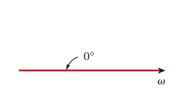  |
|                                    $(j\omega)^N$                                    | 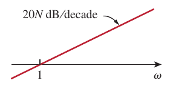  |   |
|                               $\frac{1}{(j\omega)^N}$                               |   |   |
|                          $\Big(1+\frac{j\omega}{z}\Big)^N$                          |   |   |
|                             $\frac{1}{(1+j\omega/p)^N}$                             |   | 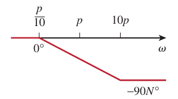 |
| $\Big[1+\frac{2j\omega\zeta}{\omega_n}+\big(\frac{j\omega}{\omega_n}\big)^2\Big]^N$ | 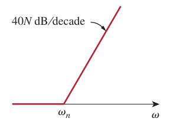 | 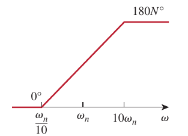 |
|            $\frac{1}{[1+2j\omega\zeta/\omega_k+(j\omega/\omega_k)^2]^N}$            |  | 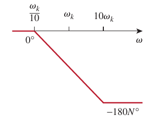 |

## 3-3 Power Considerations

### Instantaneous Power

$$
p(t) = \frac{1}{2}V_m I_m \cos (\theta_v-\theta_i)+\frac{1}{2}V_mI_m\cos(2\omega t+\theta_v+\theta_i)
$$

where we can see that the first part is constant while the second part is periodic

### Average Power

$$
P = \frac{1}{2}V_mI_m\cos(\theta_v-\theta_i)
$$

### Maximum Average Power Transfer

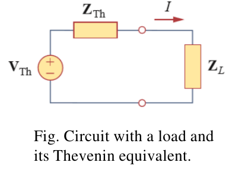

$$
P = \frac{1}{2}|I|^2R_L=\frac{|V_{Th}|^2R_L/2}{(R_{Th}+R_L)^2+(X_{Th}+X_L)^2}
$$

How to adjust the load parameters $R_L$ and $X_L$ so that **P is maximum**

$$
\begin{cases}
    X_L = -X_{Th}\\[2ex]
    R_L = \sqrt{R_{Th}^2+(X_{Th}+X_L)^2}
\end{cases}
$$

Therefore, $Z_L = R_{Th}-jX_{Th} = Z_{Th}^*$, and the maximum power is

$$
P_{max} = \frac{\|V_{Th}\|^2}{8R_{Th}}
$$

Specifically, if the load is purely real, $X_L=0$, then the maximum power is

$$
P_{max} = \frac{\|V_{th}^2\|}{4(R_L+R_{Th})}
$$

where $R_L=\sqrt{R_{Th}^2+X_{Th}^2}$

## 3-4 Series & Parallel Resonance

### Series Resonance

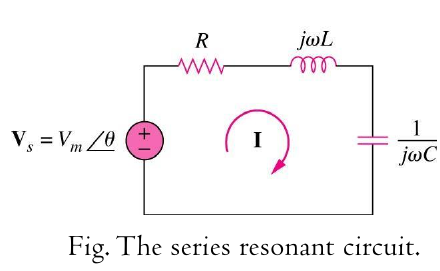

$$
Z = R+j(\omega L-\frac{1}{\omega C})
$$

Resonance is a condition in an RLC circuit in which the **capacitive and inductive reactances are equal in magnitude** thereby resulting in **a purely resistive impedance**

$$
\omega_0 = \frac{1}{\sqrt{LC}}\qquad f_0=\frac{1}{2\pi \sqrt{LC}}
$$

#### Bandwidth

Half-power frequencies $\omega_1$ and $\omega_2$ are frequencies at which the dissipated power is **half the maximum value**

$$
\omega_1 = -\frac{R}{2L}+\sqrt{\Big(\frac{R}{2L}\Big)^2+\frac{1}{LC}}\qquad \omega_2 = \frac{R}{2L}+\sqrt{\Big(\frac{R}{2L}\Big)^2+\frac{1}{LC}}
$$

where we can find

$$
\omega_0 =\sqrt{\omega_1\omega_2}\qquad B = \omega_2-\omega_1 = \frac{R}{L}
$$

#### Quality Factor

$$
Q = \frac{\omega_0L}{R} = \frac{1}{\omega_0CR}
$$

and the relationship between the $B$, $Q$ and $\omega_0$

$$
B = \frac{R}{L} = \frac{\omega_0}{Q} = \omega_0^2CR
$$

### Parallel Resonance

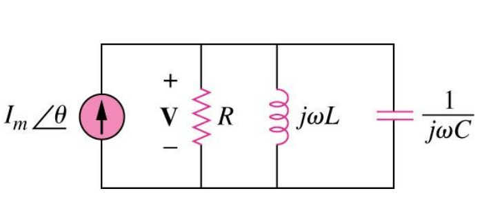

$$
Y=\frac{1}{R}+j(\omega C-\frac{1}{\omega L})
$$

similarly, the resonance happens when the circuit is purely resistive

$$
\omega_0 = \frac{1}{\sqrt{LC}}
$$

where the bandwidth becomes

$$
B= \omega_2-\omega_1 = \frac{1}{RC}\qquad Q = \frac{\omega_0}{B}=\omega_0RC=\frac{R}{\omega_0L}
$$

### Relationship Between Series and Parallel

$$
V\Leftrightarrow I\qquad L\Leftrightarrow C\qquad R \Leftrightarrow \frac{1}{R}
$$

## 3-5 Passive & Active Filters

### Passive Filters

#### LPF

| 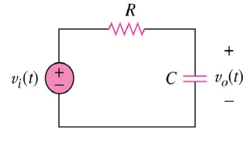 | 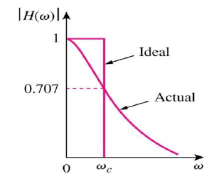 |
| :----------------------: | :----------------------: |
|         Circuit          |    Frequency Response    |

$$
\omega_C = \frac{1}{RC}
$$

#### HPF

|  |  |
| :----------------------: | :----------------------: |
|         Circuit          |    Frequency Response    |

$$
\omega_C = \frac{1}{RC}
$$

#### BPF

|  |  |
| :----------------------: | :----------------------: |
|         Circuit          |    Frequency Response    |

$$
\omega_0 = \frac{1}{\sqrt{LC}}
$$

#### BSF

| 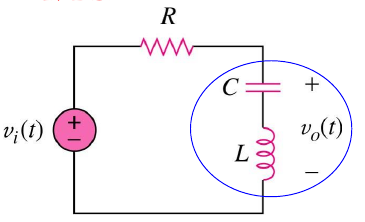 |  |
| :----------------------: | :----------------------: |
|         Circuit          |    Frequency Response    |

$$
\omega_0 = \frac{1}{\sqrt{LC}}
$$

### Active Filters

#### First-order Low-pass Filter

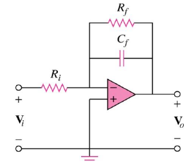

$$
\omega_C = \frac{1}{R_fC_f}
$$

#### First-order High-pass Filter

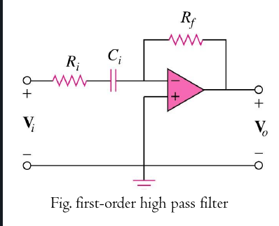

$$
\omega_C = \frac{1}{R_iC_i}
$$